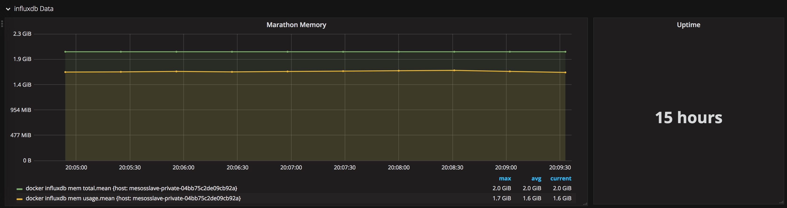

# Mesos riemann

Collects memory and network stats from the docker daemon, and pushes them to
Riemann.

## Metrics

* `docker <task_name> mem total`
* `docker <task_name> mem usage`
* `docker <task_name> mem ratio`
* `docker <task_name> net rx`
* `docker <task_name> net tx`

Forward them to Riemann and graph them in grafana, like so

